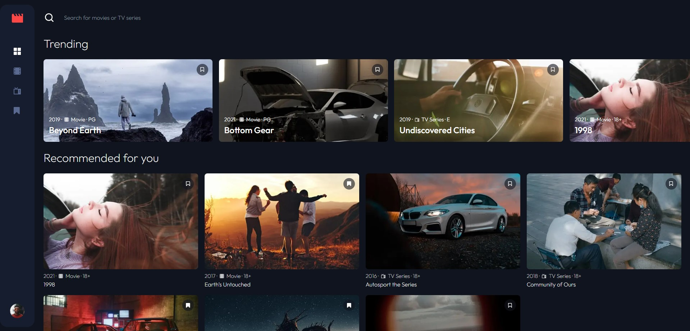

# Frontend Mentor - Entertainment web app solution

# Welcome !

Thanks for checking out this front-end coding challenge.

Frontend Mentor challenges help you improve your coding skills by building realistic projects.

To do this challenge, you need a good understanding of HTML, CSS and JavaScript.

### The challenge

Users should be able to:

- View the optimal layout for the app depending on their device's screen size
- See hover states for all interactive elements on the page
- Navigate between Home, Movies, TV Series, and Bookmarked Shows pages
- Add/Remove bookmarks from all movies and TV series
- Search for relevant shows on all pages
- **Bonus**: Build this project as a full-stack application
- **Bonus**: If you're building a full-stack app, we provide authentication screen (sign-up/login) designs if you'd like to create an auth flow

### Links

- Solution URL: [Add solution URL here](https://your-solution-url.com)
- Live Site URL: [Add live site URL here](https://your-live-site-url.com)

## My process

### Built with 🚀

- Semantic HTML5 markup
- Mobile-first workflow
- [Tailwindcss](https://tailwindcss.com/) - CSS Framework
- [Next.js](https://nextjs.org/) - React framework
- [Styled Components](https://styled-components.com/) - For styles
- [TypeScript](https://www.typescriptlang.org/)
